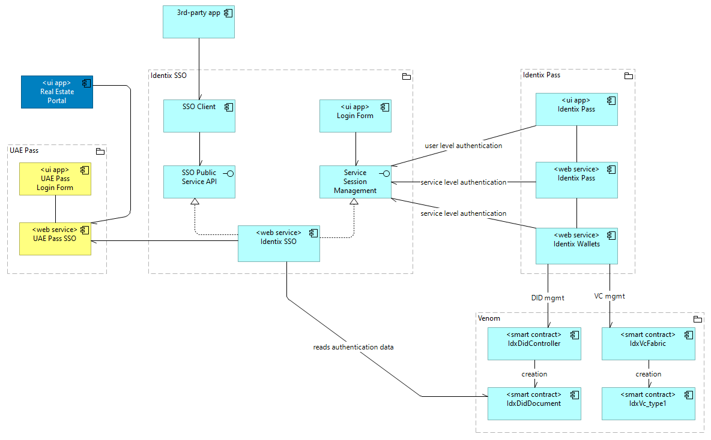

# TrustEstate solution for the Venom Hackathon 

https://hackathon.venom.network/

TrustEstate is a new identity service set to transform the real estate market in Dubai.

- The Identix.Pass custodial SSI wallet app: https://pass.identx.space/
- Real Estate Portal (simulation): https://re.identix.space

## Introduction

TrustEstate uses SSI technologies backed by Venom blockchain to establish
a secure and trusted model for agent-client interactions in the Dubai Real Estate Market.

Suppose we have a real estate owner, Bob, and a real estate buyer, Alice. Bob placed an advertisement
on a Real Estate Web Portal. Alice contacted him and they meet.

The problem is, how would Alice check that the person in front of her is an owner 
of the property or an authorized agent and not a fraudster? In the paper ages, the only solution for Alice is to ask Bob for his passport
and other documents to verify his real estate ownership rights. There are many inconveniences with such an approach.
Bob has to bring important documents in him, risking to lose them or get them stolen. 
Bob reveals his private data to many people, different buyers, when the only thing they need is an authorized fact that he has necessary rights.

In the digital era, SSI solution helps to solve these issues more securely.

## Solution Scenario

The target scenario of the real-world communication between Alice and Bob is described in detail below.

## The Walkthrough

### Setting up steps for both a real estate owner and a buyer: use the UAE.Pass staging app

1. Install the UAE.Pass Staging application from the official site: https://docs.uaepass.ae/resources/staging-apps
2. Complete a quick registration in the app, using your phone number or an email. No passport, ID card or residential status is required.

  
Click to expand/collapse screenshots

  
  
  
  This is some additional information or description about the screenshot.

### Preparation steps for a real estate owner: issue VCs and create ads
1. Log in to [Identix.Pass](https://pass.identix.space/) using the UAE Pass. A custodial wallet will be created, and a DID will be issued for you, and bound to the UAE Pass account.
2. In Identix.Pass main screen, issue your Emirates ID Verifiable Credential using the corresponding button. In a real life, this VC must be issued by a government institution or other authorized authority.
3. In Identix.Pass main screen, issue your Real Estate Ownership VC using the corresponding button. Until The UAE Department of Land is engaged, you should enter some data into the form. All fields are mandatory.
three pictures from this links:
 
 
  
Click to expand/collapse screenshots

  
  
  
  This is some additional information or description about the screenshot.

5. Log in to [Real Estate Portal](https://re.identix.space/) using "Log in via UAE Pass" button. You will be prompted to confirm the login in your UAE.Pass app.
6. Press the actions button in the page header and click "Create advertisement".
7. Enter the same values as in step #3 in the corresponding fields. The values must be precisely equal, otherwise you won't be able to verify it. You can upload an image, just for fun.

  
Click to expand/collapse screenshots

  
  
  
  This is some additional information or description about the screenshot.

### Main case workflow: Verify ownership
As a real estate **buyer**

1. Log in to [Real Estate Portal](https://re.identix.space/) using "Log in via UAE Pass" button. You will be prompted to confirm the login in your UAE.Pass app.
2. Open an advertisement item of your choice (if you'd like to verify the one you've just entered).
3. Press the "Verify ownership" button. A QR code with a verification request encoded will appear.
4. Show the QR code to the owner.

  
Click to expand/collapse screenshots

  
  
  
  This is some additional information or description about the screenshot.

As a real estate **owner**
1. In the Identix.Pass main page, click "Verify my real estate" button. The verification form will appear.
2. Press "Scan QR code" button, the camera will open. You may be prompted to give the camera-related permissions to the browser on your device.
3. Scan the QR provided with the camera.

  
Click to expand/collapse screenshots

  
  
  
  This is some additional information or description about the screenshot.

### Both the real estate owner or the buyer
See results!

  
Click to expand/collapse screenshots

  
  
  
  This is some additional information or description about the screenshot.

## Solution Architecture

The solution architecture of the TrustEstate project tailors the design Identix team built during the development 
of the SSI infrastructure for Everscale blockchain. It inherits implementation of the SSI Triangle of Trust, 
where a real estate owner impersonates Holder, a buyer impersonates Verifier. We also simulate two Issuer roles, 
and for demonstrational purposes issue two Verifiable Credential: *Emirates ID VC* and *Real Estate Ownership VC*. 
Normally, UAE Federal Authority for Identity and Citizenship and UAE Lands Department are supposed to be 
the authorities to issue and sign these credentials.

One of the specifics of the Trust Estate solution is to use [UAE Pass](https://www.digitaldubai.ae/apps-services/details/uae-pass) 
authentication to sign up and sign in to Identix Pass. We use the data provided by the UAE Pass to fill in the fields in the sample Emirates ID VC.
UAE Pass is the National Digital Identity and Digital Signature solution. 

For testing purposes, it is possible to create a limited account, bound to any phone number, via UAE Pass mobile app

Identix.Wallets service under the hood of Identix.Pass provide the custodial wallet storage. Each wallet is created and bound to 
an individual UAE account after a seamless signup via oauth2 protocol.

### The design
The solution architecture design of TrustEstate, based on the Identix SSI ecosystem for Everscale, is presented below

To learn more details on the architecture, please visit [Solution Architecture Overview](https://github.com/identix-space/everscale-ssi-contest-stage4/blob/master/docs/stage4-solution-arch.md)

### VC Brokerage Protocol and VC Data Model

The TrustEstate solution SSI protocol is a specialization of the VC Brokerage Protocol, which was developed by the Identix team.
You can find a detailed explanation on the protocol in the [Verifiable Credentials Brokerage protocol and framework overview](https://github.com/identix-space/everscale-ssi-contest-stage4/blob/master/docs/vc-brokerage-overview.md).

Important details on how we work with Decentralized Identifiers and Verifiable Credentials can be found in the 
[Verifiable Credential Lifecycle, Data Model and Implementation Design](https://github.com/identix-space/everscale-ssi-contest-stage4/blob/master/docs/vc-data-model.md)
article.

For the TrustEstate scenario, we develop a specific VC scheme, tagged `realestate_v1`.
The VC schemes are publicly available in the reference scheme storage under [https://schemas.identix.space/](https://schemas.identix.space/).

### The Real Estate Portal

https://re.identix.space/

In order to simulate a real-world case, we developed a simple real estate property classified, where we're able to add and browse 
through real estate advertisements and request to verify ownership via a QR code.

## Deliverables for TrustEstate

### Public web apps

https://re.identix.space/ - simple Real Estate Portal (for demonstrational purposes)

https://pass.identx.space/ - The Identix.Pass custodial SSI wallet app

### Onchain

VC fabric on Venom devnet [0:333723669e2723e0757cfc06c54b16ddfee3a2c751b5c4bc3aed2302c88851df](https://devnet.venomscan.com/accounts/0:333723669e2723e0757cfc06c54b16ddfee3a2c751b5c4bc3aed2302c88851df)

DID Registry on Venom devnet [0:3b1ed8da515ce663a17c17613f328ea5a3d938feefaa545abbd227d7ccd69994](https://devnet.venomscan.com/accounts/0:3b1ed8da515ce663a17c17613f328ea5a3d938feefaa545abbd227d7ccd69994)

### Public repositories
[identix-pass-service](https://github.com/identix-space/identix-pass-service), [identix-pass-service-ui](https://github.com/identix-space/identix-pass-service-ui) - Identix.Pass web app 

[identix-wallets](https://github.com/identix-space/identix-wallets) - custodial wallets service to control DIDs/VCs

[identix-sso-service](https://github.com/identix-space/identix-sso-service), [identix-sso-ui](https://github.com/identix-space/identix-sso-ui) - Single Sign-On solution

[identix-ssi-contracts](https://github.com/identix-space/identix-ssi-contracts) - DID and VC anchoring smart contracts, VC schemas

## Contacts

@identix.space
